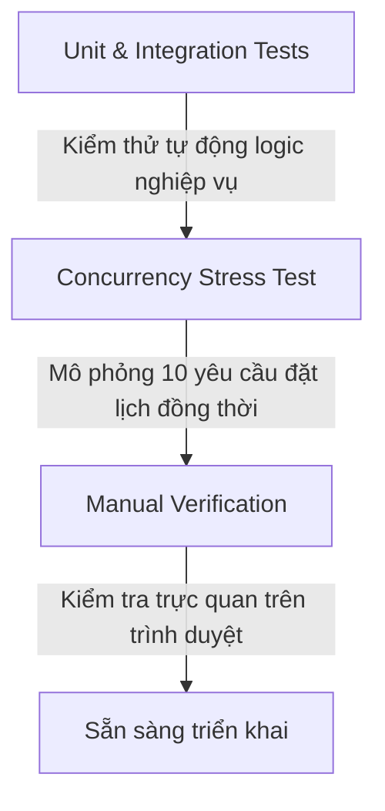

# Kế hoạch giải quyết lỗi trùng lịch hẹn và trùng khớp lịch bận của Kỹ thuật viên (KTV)

Kế hoạch này chi tiết hóa phương án phân tích, sửa lỗi mã nguồn, tối ưu hiệu năng và ngăn chặn tranh chấp đồng thời (race conditions) liên quan đến lịch hẹn và lịch bận của kỹ thuật viên tại Lumière Spa.

---

## 1. Chi tiết phân tích lỗi (Root Cause Analysis)

Qua rà soát hệ thống, chúng tôi đã phát hiện **03 vấn đề cốt lõi** gây ra lỗi trùng lịch hoặc hiển thị sai lịch bận của KTV:

### Vấn đề 1: Lỗi so sánh kiểu dữ liệu giữa Enum và String trong `AvailabilityService.java`
* **Vị trí lỗi:** Dòng 123 trong `AvailabilityService.java`.
* **Mã nguồn hiện tại:**
  ```java
  if (start.isBefore(app.getEndAt()) && end.isAfter(app.getStartAt()) && !app.getStatus().equals("CANCELLED")) {
      return false;
  }
  ```
* **Phân tích:** 
  * `app.getStatus()` trả về kiểu dữ liệu Enum `AppointmentStatus`, trong khi `"CANCELLED"` là một `String`.
  * Trong Java, phương thức `equals` của Enum khi so sánh với một `String` luôn trả về `false`.
  * Vì vậy, biểu thức `!app.getStatus().equals("CANCELLED")` luôn luôn trả về `true`.
  * **Hệ quả:** Bất kỳ lịch hẹn nào đã bị hủy (`CANCELLED`) vẫn bị thuật toán quét slot coi là một lịch hẹn hoạt động và tiếp tục chặn khung giờ đó, khiến khách hàng khác không thể đặt lịch vào giờ này.

### Vấn đề 2: Truy vấn JPQL không an toàn và thiếu tối ưu hiệu năng
* **Vị trí lỗi:** `AppointmentRepository.java` và `AvailabilityService.java`.
* **Mã nguồn hiện tại trong `AppointmentRepository.java`:**
  ```java
  @Query("SELECT a FROM Appointment a WHERE a.staffId = :staffId " +
         "AND a.status != 'CANCELLED' " +
         "AND a.startAt < :endOfDay AND a.endAt > :startOfDay")
  ```
* **Phân tích:**
  1. So sánh `a.status != 'CANCELLED'` (so sánh trực tiếp Enum với String literal trong JPQL) là không an toàn về kiểu dữ liệu (not typesafe), dễ gây lỗi khởi động hoặc lỗi dịch tùy thuộc vào DB Dialect và phiên bản Hibernate.
  2. `AvailabilityService.java` đang gọi `timeOffRepository.findByStaffId(staffId)` để lấy **toàn bộ lịch sử nghỉ phép** của nhân viên trong quá khứ và tương lai, sau đó duyệt tuyến tính trong Java. Điều này gây lãng phí bộ nhớ và CPU khi dữ liệu phát triển lớn.

### Vấn đề 3: Tranh chấp đồng thời (Race Condition) khi đặt lịch
* **Vị trí lỗi:** `BookingManager.java`.
* **Phân tích:** 
  * Khi hai khách hàng A và B cùng truy cập một slot trống duy nhất của KTV X tại cùng một thời điểm và bấm "Xác nhận đặt lịch".
  * Cả hai luồng xử lý đồng thời kiểm tra `validateConflict` và đều thấy KTV X đang trống (vì giao dịch của luồng kia chưa được commit xuống DB).
  * **Hệ quả:** Cả hai lịch hẹn đều được tạo thành công ở trạng thái `PENDING`, dẫn đến việc KTV bị **trùng lịch (double-booked)** ở cùng một khung giờ.

---

## 2. Giải pháp và các file cụ thể cần thay đổi

### 2.1. Thay đổi phía Backend

#### 📂 File 1: `workflow-backend/src/main/java/com/dangquocvinh/workflow_backend/booking/service/AvailabilityService.java`
* **Mục tiêu:** Sửa lỗi so sánh Enum và tối ưu hóa việc lấy lịch bận.
* **Thay đổi chi tiết:**
  * Sửa dòng 123 từ `.equals("CANCELLED")` thành so sánh Enum chuẩn xác:
    ```diff
    - if (start.isBefore(app.getEndAt()) && end.isAfter(app.getStartAt()) && !app.getStatus().equals("CANCELLED")) {
    + if (start.isBefore(app.getEndAt()) && end.isAfter(app.getStartAt()) && app.getStatus() != AppointmentStatus.CANCELLED) {
    ```
  * Tối ưu hóa truy vấn lịch nghỉ phép của KTV bằng cách chỉ lấy lịch nghỉ trùng khớp với ngày đang xét:
    ```diff
    - List<StaffTimeOff> timeOffs = timeOffRepository.findByStaffId(staffId);
    + List<StaffTimeOff> timeOffs = timeOffRepository.findOverlapTimeOffs(staffId, date.atStartOfDay(), date.plusDays(1).atStartOfDay());
    ```

#### 📂 File 2: `workflow-backend/src/main/java/com/dangquocvinh/workflow_backend/booking/repository/AppointmentRepository.java`
* **Mục tiêu:** Định nghĩa lại truy vấn JPQL an toàn về kiểu dữ liệu.
* **Thay đổi chi tiết:**
  ```diff
  - @Query("SELECT a FROM Appointment a WHERE a.staffId = :staffId " +
  -        "AND a.status != 'CANCELLED' " +
  -        "AND a.startAt < :endOfDay AND a.endAt > :startOfDay")
  + @Query("SELECT a FROM Appointment a WHERE a.staffId = :staffId " +
  +        "AND a.status != com.dangquocvinh.workflow_backend.booking.entity.AppointmentStatus.CANCELLED " +
  +        "AND a.startAt < :endOfDay AND a.endAt > :startOfDay")
  ```

#### 📂 File 3: `workflow-backend/src/main/java/com/dangquocvinh/workflow_backend/staff/repository/StaffTimeOffRepository.java`
* **Mục tiêu:** Thêm truy vấn tối ưu chỉ lấy lịch nghỉ phép trong ngày được yêu cầu.
* **Thay đổi chi tiết:**
  ```java
  package com.dangquocvinh.workflow_backend.staff.repository;

  import com.dangquocvinh.workflow_backend.staff.entity.StaffTimeOff;
  import org.springframework.data.jpa.repository.JpaRepository;
  import org.springframework.data.jpa.repository.Query;
  import org.springframework.data.repository.query.Param;
  import java.time.LocalDateTime;
  import java.util.List;
  import java.util.UUID;

  public interface StaffTimeOffRepository extends JpaRepository<StaffTimeOff, UUID> {
      List<StaffTimeOff> findByStaffId(UUID staffId);

      @Query("SELECT t FROM StaffTimeOff t WHERE t.staffId = :staffId " +
             "AND t.startAt < :endOfDay AND t.endAt > :startOfDay")
      List<StaffTimeOff> findOverlapTimeOffs(@Param("staffId") UUID staffId, 
                                             @Param("startOfDay") LocalDateTime startOfDay, 
                                             @Param("endOfDay") LocalDateTime endOfDay);
  }
  ```

#### 📂 File 4: `workflow-backend/src/main/java/com/dangquocvinh/workflow_backend/staff/repository/StaffProfileRepository.java`
* **Mục tiêu:** Thêm cơ chế Khóa bi quan (Pessimistic Locking) để ngăn chặn Race Condition khi nhiều khách hàng đặt cùng một KTV.
* **Thay đổi chi tiết:**
  ```java
  package com.dangquocvinh.workflow_backend.staff.repository;

  import com.dangquocvinh.workflow_backend.staff.entity.StaffProfile;
  import com.dangquocvinh.workflow_backend.user.entity.User;
  import jakarta.persistence.LockModeType;
  import org.springframework.data.jpa.repository.JpaRepository;
  import org.springframework.data.jpa.repository.Lock;
  import org.springframework.data.jpa.repository.Query;
  import org.springframework.data.repository.query.Param;
  import java.util.Optional;
  import java.util.UUID;

  public interface StaffProfileRepository extends JpaRepository<StaffProfile, UUID> {
      Optional<StaffProfile> findByUser(User user);

      @Lock(LockModeType.PESSIMISTIC_WRITE)
      @Query("SELECT s FROM StaffProfile s WHERE s.id = :id")
      Optional<StaffProfile> findByIdForUpdate(@Param("id") UUID id);
  }
  ```

#### 📂 File 5: `workflow-backend/src/main/java/com/dangquocvinh/workflow_backend/booking/service/BookingManager.java`
* **Mục tiêu:** Sử dụng cơ chế khóa bi quan khi tạo hoặc cập nhật lịch hẹn để bảo vệ tính toàn vẹn dữ liệu.
* **Thay đổi chi tiết:**
  * Thêm `StaffProfileRepository` vào constructor của `BookingManager`.
  * Tại phương thức `createAppointment` và `reschedule`, tải thông tin KTV lên bằng phương thức khóa bi quan để đồng bộ hóa các yêu cầu đồng thời:
    ```java
    // Tại đầu phương thức createAppointment và reschedule:
    staffRepository.findByIdForUpdate(staffId)
        .orElseThrow(() -> new RuntimeException("Kỹ thuật viên không tồn tại"));
    ```

#### 📂 File 6: `workflow-backend/src/main/java/com/dangquocvinh/workflow_backend/staff/entity/WorkingSchedule.java`
* **Mục tiêu:** Cập nhật chú thích gây nhầm lẫn để đảm bảo tính nhất quán của mã nguồn.
* **Thay đổi chi tiết:**
  ```diff
  - private Integer dayOfWeek; // 2 to 8 (Monday to Sunday)
  + private Integer dayOfWeek; // 1 to 7 (Monday to Sunday)
  ```

---

### 2.2. Thay đổi phía Frontend

#### 📂 File 7: `workflow-frontend/src/pages/BookingPage.jsx`
* **Mục tiêu:** Cải thiện trải nghiệm người dùng (UX) khi xảy ra lỗi xung đột lịch hẹn.
* **Thay đổi chi tiết:**
  * Khi phương thức `handleBooking` trả về lỗi (do KTV đã bị người khác đặt trước trong quá trình thao tác), tự động gọi lại hàm tải danh sách slot trống và thông báo cho khách hàng chọn khung giờ khác thay vì bắt họ tải lại trang hoặc chọn lại từ đầu.
  ```javascript
  const handleBooking = async () => {
    const loadingToast = toast.loading('Đang xử lý đặt lịch...');
    try {
      const payload = {
        branchId: bookingData.branchId,
        staffId: bookingData.staffId,
        serviceIds: [bookingData.serviceId],
        startAt: `${bookingData.date}T${bookingData.slot}`,
        note: bookingData.note
      };
      
      await api.post('/appointments', payload);
      toast.success('Đặt lịch thành công!', { id: loadingToast });
      navigate('/my-appointments');
    } catch (error) {
      toast.error('Đặt lịch thất bại. Khung giờ này vừa mới được đặt bởi khách hàng khác. Đang cập nhật lại danh sách lịch trống...', { id: loadingToast });
      // Tải lại danh sách lịch trống của KTV
      if (bookingData.staffId && bookingData.date) {
        api.get('/availability', {
          params: { 
            staffId: bookingData.staffId, 
            date: bookingData.date,
            serviceId: bookingData.serviceId,
            branchId: bookingData.branchId
          }
        }).then(res => {
          setAvailableSlots(res.data);
          setBookingData(prev => ({ ...prev, slot: '' })); // Reset slot đã chọn
          setStep(3); // Quay lại bước chọn thời gian
        }).catch(() => toast.error('Không thể cập nhật danh sách lịch trống mới.'));
      }
    }
  };
  ```

---

## 3. Kế hoạch xác minh (Verification Plan)

Để đảm bảo chất lượng xử lý triệt để và không phát sinh lỗi phụ (regression), chúng tôi đề xuất quy trình xác minh 3 tầng:



### 3.1. Kiểm thử tự động (Automated Backend Tests)
Tạo class kiểm thử tích hợp `BookingConflictTests.java` trong thư mục `src/test/java` của backend để tự động hóa việc xác minh:

| Kịch bản kiểm thử | Dữ liệu đầu vào | Kết quả mong đợi |
| :--- | :--- | :--- |
| **1. Hủy lịch giải phóng slot** | Tạo lịch hẹn trạng thái `CANCELLED` từ 10:00 - 11:00. Gọi `findAvailableSlots` cho ngày đó. | Slot `10:00` phải hiển thị là **còn trống (Available)**. |
| **2. Phát hiện lịch trùng** | Tạo lịch hẹn trạng thái `CONFIRMED` từ 10:00 - 11:00. Thử tạo lịch hẹn mới từ 10:30 - 11:30 cho cùng một KTV. | Hệ thống phải ném ra ngoại lệ `RuntimeException` với thông báo "Kỹ thuật viên đã bận trong khung giờ này." |
| **3. Lịch nghỉ phép chặn slot** | Đăng ký lịch nghỉ phép `StaffTimeOff` từ 14:00 - 16:00. Gọi `findAvailableSlots`. | Các slot từ `14:00` đến `15:30` phải **bị loại bỏ** khỏi danh sách lịch trống. |
| **4. Đồng thời (Concurrency)** | Khởi chạy 2 luồng đồng thời cố gắng đặt cùng một slot của một KTV. | 1 luồng thành công và 1 luồng thất bại với lỗi trùng lịch (Không có hiện tượng double-booking). |

### 3.2. Chạy bộ công cụ kiểm tra tự động của hệ thống
Sau khi hoàn thành việc triển khai mã nguồn, tiến hành chạy toàn bộ bộ test và linter của dự án bằng lệnh:
```bash
# Di chuyển vào backend và chạy test suite
mvn clean test

# Sử dụng công cụ kiểm tra chất lượng mã nguồn
python .agent/scripts/checklist.py .
```

### 3.3. Xác minh thủ công (Manual Verification Steps)
1. Đăng nhập tài khoản khách hàng trên Frontend.
2. Đặt một lịch hẹn mới vào lúc `09:00` ngày mai với KTV A.
3. Đăng nhập tài khoản Admin/Manager, tìm lịch hẹn vừa tạo và chuyển trạng thái sang **Hủy lịch** (`CANCELLED`).
4. Quay lại trang đặt lịch của khách hàng, kiểm tra xem khung giờ `09:00` ngày mai của KTV A đã xuất hiện trở lại hay chưa.
5. Thử đặt lại khung giờ đó để chắc chắn hệ thống cho phép đặt bình thường.
