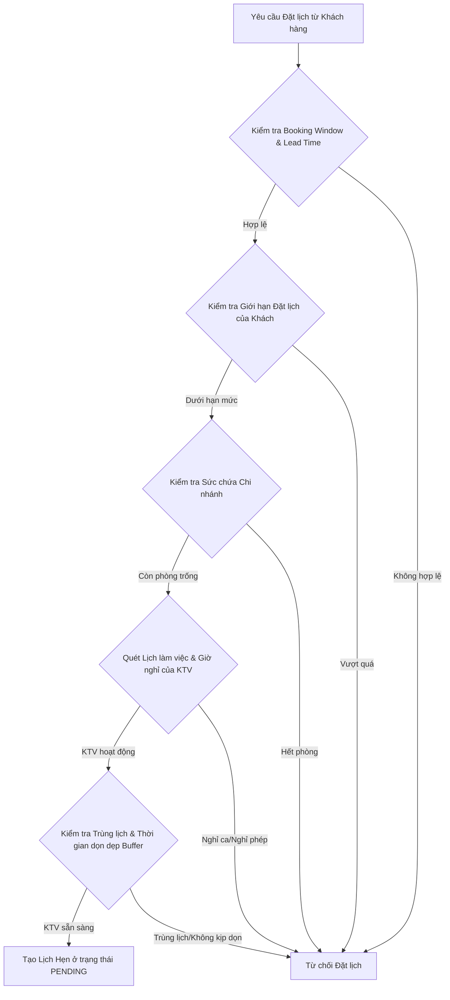

# TÀI LIỆU PHÂN TÍCH & ĐỀ XUẤT CẢI TIẾN NGHIỆP VỤ ĐẶT LỊCH (SPA BOOKING SYSTEM)

Tài liệu này phân tích sâu sắc các khoảng trống nghiệp vụ thực tế giữa hệ thống hiện tại và quy trình vận hành Spa chuyên nghiệp, đồng thời đề xuất giải pháp tái cấu trúc mã nguồn ở cả **Backend (Spring Boot)** và **Frontend (React)**.

---

## I. Phân Tích Hiện Trạng & Lỗ Hổng Nghiệp Vụ

### 1. Thời lượng dịch vụ & Thời gian dọn dẹp (Duration & Turnaround Buffer Time)
* **Thực trạng hệ thống:** Dịch vụ có thời lượng (`durationMinutes`), hệ thống xếp lịch khít nhau (ví dụ: Ca 1 từ 9:00 - 10:00, Ca 2 có thể bắt đầu ngay lúc 10:00).
* **Vấn đề thực tế:** Kỹ thuật viên (KTV) cần ít nhất **10 - 15 phút** sau mỗi ca để: dọn dẹp giường, thay drap/khăn mới, khử khuẩn dụng cụ, lấy tinh dầu/mỹ phẩm và nghỉ ngơi nhanh trước khi đón lượt khách tiếp theo. Xếp lịch khít nhau sẽ gây trễ giờ dây chuyền và giảm chất lượng dịch vụ.
* **Giao diện đặt lịch combo:** Khách hàng có thể chọn nhiều dịch vụ cùng lúc. Backend tính tổng thời lượng (`totalDuration`), nhưng API tìm slot trống (`AvailabilityService`) hiện chỉ nhận **duy nhất một `serviceId`**. Điều này gây lỗi nghiêm trọng khi khách chọn combo nhưng hệ thống chỉ tính slot cho 1 dịch vụ.

### 2. Lịch làm việc & Ca trực của Kỹ thuật viên (Staff Schedules & Breaks)
* **Thực trạng hệ thống:** KTV có lịch làm việc cố định theo thứ trong tuần (`WorkingSchedule` lưu `startTime` và `endTime`).
* **Vấn đề thực tế:** 
  * KTV làm ca dài (ví dụ 9:00 - 21:00 hoặc ca gãy) luôn cần có **giờ nghỉ giữa ca** (nghỉ trưa/nghỉ tối từ 60 - 90 phút). Hiện tại hệ thống coi KTV rảnh liên tục suốt ca trực, dẫn đến việc xếp lịch đè lên giờ ăn trưa/nghỉ ngơi của họ.
  * Lịch nghỉ phép đột xuất/ngày lễ (`StaffTimeOff`) đang được kiểm tra thủ công. Hệ thống cần tự động đồng bộ hóa để khóa các slot trùng với lịch nghỉ phép được phê duyệt.

### 3. Giới Hạn Khung Thời Gian Đặt Lịch (Lead Time & Booking Window)
* **Thực trạng hệ thống:** API kiểm tra slot trống có chặn giờ quá khứ trong ngày hiện tại. Tuy nhiên, API lưu lịch đặt (`BookingManager.createAppointment`) **hoàn toàn không có validate** về thời gian đặt. Khách hàng có thể gửi request qua API để đặt lịch vào năm ngoái hoặc 5 năm sau!
* **Vấn đề thực tế:**
  * **Giờ đệm chuẩn bị (Lead Time):** Không cho phép đặt quá sát giờ hiện tại (ví dụ: ít nhất phải đặt trước **60 phút** để chi nhánh và KTV kịp chuẩn bị).
  * **Cửa sổ đặt lịch (Booking Window):** Chỉ cho phép đặt lịch trong tương lai tối đa **30 ngày** hoặc **60 ngày**. Đặt quá xa sẽ không kiểm soát được biến động nhân sự, thay đổi bảng giá hoặc lịch làm việc của chi nhánh.

### 4. Giới Hạn Sức Chứa Của Chi Nhánh (Branch Capacity / Rooms & Beds)
* **Thực trạng hệ thống:** Chỉ kiểm tra xem KTV có bận hay không.
* **Vấn đề thực tế:** Mỗi chi nhánh spa có giới hạn số lượng giường massage/phòng dịch vụ (ví dụ: Chi nhánh A chỉ có 10 giường). Dù có 12 KTV rảnh, spa cũng chỉ phục vụ tối đa được 10 khách cùng lúc. Nếu không giới hạn sức chứa chi nhánh, spa sẽ bị quá tải cơ sở vật chất.

### 5. Chính Sách Hủy/Đổi Lịch (Cancellation & Rescheduling Policy)
* **Thực trạng hệ thống:** Khách hàng có thể gửi yêu cầu hủy lịch bất cứ lúc nào qua API.
* **Vấn đề thực tế:** Khách hàng chỉ được phép tự hủy hoặc đổi lịch **trước giờ hẹn tối thiểu 2 - 4 tiếng** (chính sách tránh tổn thất cho spa khi KTV đã chuẩn bị phòng). Khi sát giờ hoặc đã quá giờ hẹn, nút "Hủy lịch" trên giao diện phải bị khóa và khách hàng buộc phải gọi hotline của Spa để xử lý thủ công.

---

## II. Đề Xuất Giải Pháp Tái Cấu Trúc Toàn Diện

Để giải quyết triệt để các vấn đề trên, chúng tôi đề xuất bộ giải pháp kỹ thuật cụ thể dưới đây:



### 1. Backend (Spring Boot) - Tái Cấu Trúc Logic Nghiệp Vụ

#### A. Cập Nhật Cấu Hình Tham Số Nghiệp Vụ (System Configurations)
Thêm các tham số cấu hình linh hoạt trong `application.properties` hoặc lưu vào cơ sở dữ liệu để dễ dàng điều chỉnh:
```properties
# Khoảng thời gian đệm tối thiểu để KTV dọn dẹp sau mỗi ca phục vụ (phút)
spa.booking.buffer-minutes=15

# Khoảng thời gian tối thiểu khách phải đặt trước giờ hẹn (phút)
spa.booking.lead-time-minutes=60

# Số ngày tối đa trong tương lai khách được phép đặt trước
spa.booking.max-days-ahead=30

# Số lượng lịch hẹn trạng thái PENDING tối đa của 1 tài khoản khách hàng để tránh spam
spa.booking.max-pending-limits=3
```

#### B. Nâng Cấp `AvailabilityService.java`
Tái cấu trúc API lấy danh sách slot trống để hỗ trợ:
1. **Đặt nhiều dịch vụ cùng lúc (Combo Services):** Tính toán tổng thời lượng và quét slot dựa trên tổng thời gian của cả danh sách dịch vụ.
2. **Cộng thêm thời gian dọn dẹp (Buffer Time):** Thời gian KTV bận thực tế cho mỗi lịch hẹn sẽ bằng `durationMinutes + bufferMinutes`.
3. **Chặn giờ nghỉ giữa ca của KTV:** Đọc thông tin giờ nghỉ cố định từ `WorkingSchedule` (hoặc cấu hình mặc định ví dụ 12:00 - 13:00) để loại bỏ các slot đè lên giờ nghỉ.

```java
// Cải tiến Signature của phương thức tìm slot trống để nhận danh sách dịch vụ
public List<LocalTime> findAvailableSlots(List<UUID> serviceIds, UUID branchId, UUID staffId, LocalDate date) {
    // 1. Tính tổng thời lượng của toàn bộ dịch vụ được chọn
    int totalDuration = 0;
    for (UUID sid : serviceIds) {
        SpaService service = serviceRepository.findById(sid).orElseThrow();
        totalDuration += service.getDurationMinutes();
    }
    
    // Cộng thêm thời gian dọn dẹp phòng/giường chuẩn bị ca tiếp theo
    int totalDurationWithBuffer = totalDuration + bufferMinutes; 
    
    // 2. Lấy giờ mở/đóng cửa chi nhánh
    // 3. Lấy lịch trực làm việc của KTV và trừ đi giờ nghỉ trưa (ví dụ: KTV nghỉ từ 12:00 - 13:00)
    // 4. Quét slot mỗi 30 phút, đảm bảo slotStart + totalDurationWithBuffer <= Giờ KTV ra về & Giờ Spa đóng cửa
    // 5. Kiểm tra trùng lịch hẹn khác hoặc lịch nghỉ phép đột xuất
}
```

#### C. Thêm Trình Validate Nghiệp Vụ Chặt Chẽ Trong `BookingManager.java`
Trước khi lưu lịch hẹn mới vào cơ sở dữ liệu, bắt buộc phải chạy qua chuỗi kiểm tra (Validation Pipeline):
```java
public void validateBookingBusinessRules(UUID customerId, LocalDateTime startAt, int totalDuration) {
    LocalDateTime now = LocalDateTime.now();
    
    // 1. Kiểm tra Lead Time (Đặt lịch quá sát giờ)
    if (startAt.isBefore(now.plusMinutes(leadTimeMinutes))) {
        throw new RuntimeException("Thời gian đặt lịch tối thiểu phải trước giờ hẹn " + leadTimeMinutes + " phút.");
    }
    
    // 2. Kiểm tra Booking Window (Đặt lịch quá xa trong tương lai)
    if (startAt.isAfter(now.plusDays(maxDaysAhead))) {
        throw new RuntimeException("Chỉ cho phép đặt lịch trước tối đa " + maxDaysAhead + " ngày.");
    }
    
    // 3. Kiểm tra lịch hẹn trong quá khứ
    if (startAt.isBefore(now)) {
        throw new RuntimeException("Không thể đặt lịch hẹn trong quá khứ.");
    }
    
    // 4. Kiểm tra giới hạn số lượng lịch hẹn chờ duyệt của khách hàng
    long pendingCount = appointmentRepository.countByCustomerIdAndStatus(customerId, AppointmentStatus.PENDING);
    if (pendingCount >= maxPendingLimits) {
        throw new RuntimeException("Bạn đã đạt giới hạn tối đa " + maxPendingLimits + " lịch hẹn chờ xác nhận. Vui lòng đợi quản trị viên duyệt trước khi đặt lịch mới.");
    }
}
```

#### D. Quản Lý Sức Chứa Chi Nhánh (Branch Capacity)
Thêm trường `totalBeds` hoặc `capacity` vào thực thể `Branch`. Khi khách đặt lịch, backend sẽ đếm số lượng lịch hẹn đang diễn ra đồng thời tại chi nhánh đó. Nếu số lượng lịch hẹn vượt quá số giường hiện có, hệ thống sẽ báo chi nhánh đã hết chỗ nhận khách tại khung giờ đó kể cả khi KTV còn rảnh.

---

### 2. Frontend (React) - Cải Tiến Trải Nghiệm Đặt Lịch Trực Quan

#### A. Ràng Buộc Bộ Chọn Ngày Đặt Lịch (Date Picker Constraints)
* Cấu hình thuộc tính `min` và `max` trên ô chọn ngày (DatePicker) để giới hạn chặt chẽ:
  * `minDate`: Ngày hôm nay (`new Date()`).
  * `maxDate`: Hôm nay + 30 ngày (Booking Window).
* Chặn hoàn toàn việc gõ tay nhập ngày không hợp lệ.

#### B. Cập Nhật Luồng Chọn Dịch Vụ Và Tìm Slot Trống
* Giao diện người dùng cho phép tích chọn nhiều dịch vụ cùng lúc (chọn Combo).
* Khi gọi API lấy slot trống, frontend sẽ truyền danh sách `serviceIds` (ví dụ: `GET /api/availability?services=id1,id2&branchId=...&staffId=...&date=...`) thay vì chỉ truyền 1 dịch vụ đơn lẻ như trước. Điều này đảm bảo các khung giờ hiển thị cho người dùng chọn là hoàn toàn chính xác cho cả gói liệu trình dài.

#### C. Chính Sách Nút Hủy Lịch Trên Trang Cá Nhân (User Profile page)
* Trên trang lịch sử lịch hẹn của khách hàng, nút **Hủy lịch** chỉ hiển thị hoặc kích hoạt nếu:
  * Trạng thái lịch hẹn là `PENDING` hoặc `CONFIRMED`.
  * Thời gian hiện tại cách thời gian bắt đầu lịch hẹn (`startAt`) **ít nhất 2 tiếng**.
* Nếu sát giờ hơn, nút **Hủy lịch** sẽ bị mờ đi (disabled) kèm theo tooltip giải thích: *"Không thể tự hủy lịch hẹn sát giờ phục vụ (dưới 2 tiếng). Vui lòng liên hệ Hotline chi nhánh để được trợ giúp."*

---

## III. Kế Hoạch Triển Khai Chi Tiết (Implementation Plan)

### Bước 1: Điều Chỉnh Database Schema
* Thêm trường `capacity` (Số lượng giường/phòng phục vụ tối đa) vào bảng `branches`.
* Cập nhật các bảng nếu cần để lưu trữ cấu hình giờ nghỉ của KTV.

### Bước 2: Viết Lại Các Hàm Tính Toán Lịch Bận & Slot Trống
* Tích hợp `Buffer Time` dọn dẹp vào thuật toán quét slot trong `AvailabilityService`.
* Cập nhật API Endpoint của `/api/availability` để hỗ trợ nhận mảng `serviceIds` từ Client.

### Bước 3: Áp Dụng Bộ Kiểm Tra Nghiệp Vụ (Validators)
* Tích hợp bộ kiểm tra khoảng thời gian đặt (Lead Time, Booking Window) vào cả luồng đặt mới (`createAppointment`) và luồng đổi lịch (`reschedule`).

### Bước 4: Cập Nhật UI & Xử Lý Ngoại Lệ
* Thiết kế lại màn hình Đặt Lịch để gửi danh sách dịch vụ đã chọn lên API tìm Slot.
* Xử lý hiển thị thông báo lỗi thân thiện khi khách hàng vi phạm các quy tắc nghiệp vụ (ví dụ: Vượt hạn mức spam, đặt lịch sát giờ).
